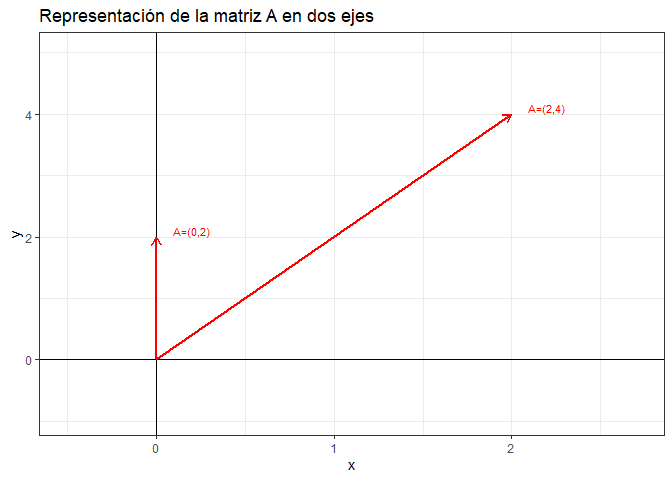
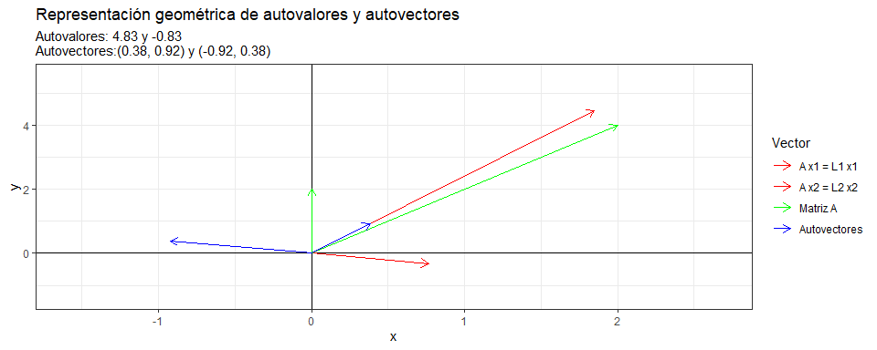
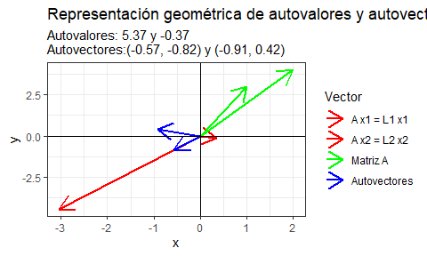
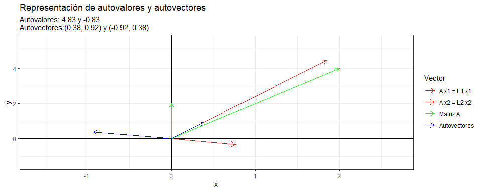

Autovalores y autovectores
================
Karina Bartolomé

# Matrices en R:

Matriz identidad de 2x2:

    ##      [,1] [,2]
    ## [1,]    1    0
    ## [2,]    0    1

Se define una matriz A (m x n):

``` r
A <- t(matrix(c(0, 2, 
                2, 4), 
              nrow = 2, ncol = 2))
A
```

    ##      [,1] [,2]
    ## [1,]    0    2
    ## [2,]    2    4

Gráficamente:

<!-- -->

# Autovalores y autovectores

Dados

*A* ∈ *𝚁*<sub>*n**n*</sub> , *λ* ∈ *𝚁* , *V* ∈ *𝚁*<sub>*n*1</sub>

Se dice que **λ** es un **autovalor** de A si y sólo si existe un vector
**V** (**autovector**) no nulo tal que:

A V = λ V

# Cálculo de autovalores (eigenvalues)

Existen tantos autovalores como número de filas (m) o columnas (n) tiene
la matriz original.

A V −λ V = 0

( A − λ I ) V = 0

\| A − λ I \| = 0 –\> **Ecuación característica de la matriz A**

En donde

p(λ)=\|A–λI\| es un polinomio de grado n dependiente de λ –\>
**polinomio característico de la matriz A**

------------------------------------------------------------------------

Si λ = 2 =\> A - 2 \* I :

    ##      [,1] [,2]
    ## [1,]   -2    2
    ## [2,]    2    2

Calculando el determinante \| A − λ I \|

    ## [1] -8

No es igual a 0, con lo cual λ = 2 no es un autovalor de la matriz A.

Calculando los autovalores que resuelvan la ecuación:

``` r
autovalores <- eigen(A)$values
autovalores
```

    ## [1]  4.8284271 -0.8284271

Notar que si se calcula el determinante \| A − λ I \| para estos
autovalores da 0:

``` r
det(A - autovalores[1]*I)
```

    ## [1] -1.608189e-15

``` r
det(A - autovalores[2]*I)
```

    ## [1] 0

(puede no dar 0 exacto por redondeos en el cálculo de los autovalores)

# Cálculo de autovectores

Autovectores:

``` r
autovectores <- eigen(A)$vectors
autovectores
```

    ##           [,1]       [,2]
    ## [1,] 0.3826834 -0.9238795
    ## [2,] 0.9238795  0.3826834

# Volviendo a A V = λ V

``` r
round(A %*% autovectores[,1],3) == round(matrix(autovectores[,1] * 
                                            autovalores[1], nrow=2),3)
```

    ##      [,1]
    ## [1,] TRUE
    ## [2,] TRUE

A V :

``` r
AX1 = A %*% autovectores[1,]
AX2 = A %*% autovectores[2,]
```

λ V :

``` r
X1L1 = autovectores[1,] * autovalores[1]
X2L2 = autovectores[2,] * autovalores[2]
```

``` r
print(X1L1)
```

    ## [1]  1.847759 -4.460885

``` r
print(AX2)
```

    ##           [,1]
    ## [1,] 0.7653669
    ## [2,] 3.3784928

``` r
print(X2L2)
```

    ## [1] -0.7653669 -0.3170253

``` r
print(AX1)
```

    ##           [,1]
    ## [1,] -1.847759
    ## [2,] -2.930151

# Gráficamente:

Visualizando el ejemplo de la matriz A. Se observa que se cumple la
igualdad A V = λ V.

Además, se ve como para cada autovector (X1 y X2):

*A* \* *X*<sub>1</sub> = *λ*<sub>1</sub> \* *X*<sub>1</sub>

*A* \* *X*<sub>2</sub> = *λ*<sub>2</sub> \* *X*<sub>2</sub>

Cuando el autovalor es positivo, el autovector V se expande en la misma
dirección mientras que cuando el autovalor es negativo el autovector V
se expande en la dirección opuesta.

<!-- -->

Considerando una matriz A distinta:

    ##      [,1] [,2]
    ## [1,]    3    1
    ## [2,]    2    4

<!-- -->

Otro ejemplo:

    ##      [,1] [,2]
    ## [1,]    1    3
    ## [2,]    2    4

<!-- -->

# Links

[Eigenvectors and Eigenvalues Explained
Visually](https://setosa.io/ev/eigenvectors-and-eigenvalues/)
