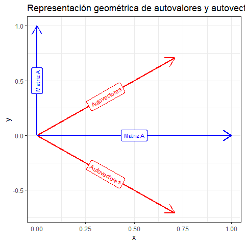
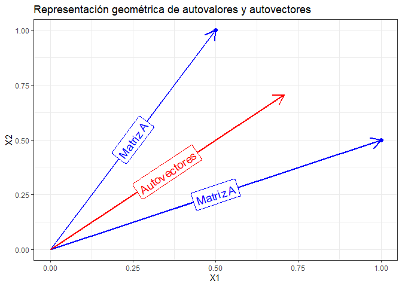

Autovalores y autovectores
================
Karina Bartolomé

# Matrices en R

Matriz identidad:

    ##      [,1] [,2]
    ## [1,]    1    0
    ## [2,]    0    1

# Autovalores y autovectores

Los autovalores son escalares que al ser multiplicados por un vector no
negativo se cumple la igualdad:

A x = λ x

# Cálculo de autovalores (eigenvalues)

A x−λ x = 0

( A − λ I ) x = 0

\| A − λ I \| = 0 –\> **Ecuación característica**

``` r
A <- t(matrix(c(0.5, 1, 1, 0.5), nrow = 2, ncol = 2))

A <- t(matrix(c(0, 1, 1, 0), nrow = 2, ncol = 2))

A
```

    ##      [,1] [,2]
    ## [1,]    0    1
    ## [2,]    1    0

Si λ = 1 =\> A - 1 \* I :

    ##      [,1] [,2]
    ## [1,]   -1    1
    ## [2,]    1   -1

Calculando el determinante \| A − λ I \|

    ## [1] 0

No es igual a 0, con lo cual λ = 0 no es un autovalor de la matriz A.

Calculando los autovalores que resuelvan la ecuación luego de la
expansión de Laplace:

``` r
autovalores <- eigen(A)$values
autovalores
```

    ## [1]  1 -1

Notar que si se hace:

    ## [1] 0

    ## [1] 0

# Cálculo de autovectores

Autovectores:

``` r
autovectores <- eigen(A)$vectors
autovectores
```

    ##           [,1]       [,2]
    ## [1,] 0.7071068 -0.7071068
    ## [2,] 0.7071068  0.7071068

# Volviendo a A x = λ x

A x :

``` r
AX1 = A %*% autovectores[1,]
AX2 = A %*% autovectores[2,]
```

λ x :

``` r
XL1 = autovectores[2,] * autovalores[1]
XL2 = autovectores[1,] * autovalores[2]
```

``` r
print(XL1)
```

    ## [1] 0.7071068 0.7071068

``` r
print(AX2)
```

    ##           [,1]
    ## [1,] 0.7071068
    ## [2,] 0.7071068

``` r
print(XL2)
```

    ## [1] -0.7071068  0.7071068

``` r
print(AX1)
```

    ##            [,1]
    ## [1,] -0.7071068
    ## [2,]  0.7071068

# Gráficamente:

Se observa que la pendiente de los autovectores son los autovalores (1 y
-1).

<!-- -->

Imponiendo una restricción a valores positivos:

<!-- -->
