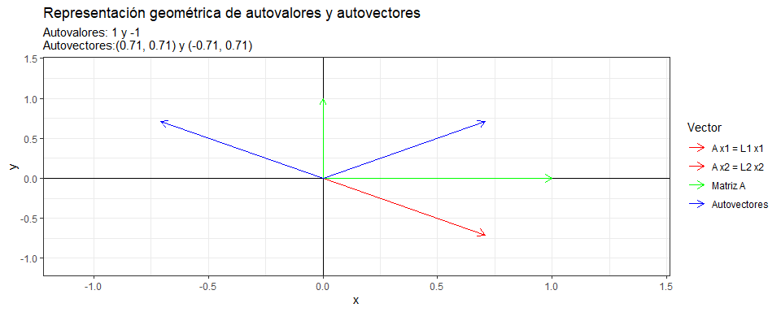

Autovalores y autovectores
================
Karina Bartolomé

# Matrices en R:

Matriz identidad:

    ##      [,1] [,2]
    ## [1,]    1    0
    ## [2,]    0    1

# Autovalores y autovectores

Los autovalores son escalares que al ser multiplicados por un vector no
negativo se cumple la igualdad:

A x = λ x

# Cálculo de autovalores (eigenvalues)

A x−λ x = 0

( A − λ I ) x = 0

\| A − λ I \| = 0 –\> **Ecuación característica**

Se define una matriz A:

``` r
A <- t(matrix(c(0, 1, 1, 0), nrow = 2, ncol = 2))
A
```

    ##      [,1] [,2]
    ## [1,]    0    1
    ## [2,]    1    0

Si λ = 3 =\> A - 3 \* I :

    ##      [,1] [,2]
    ## [1,]   -2    1
    ## [2,]    1   -2

Calculando el determinante \| A − λ I \|

    ## [1] 3

No es igual a 0, con lo cual λ = 2 no es un autovalor de la matriz A.

Calculando los autovalores que resuelvan la ecuación:

``` r
autovalores <- eigen(A)$values
autovalores
```

    ## [1]  1 -1

Notar que si se calcula el determinante \| A − λ I \| para estos
autovalores da 0:

``` r
det(A - autovalores[1]*I)
```

    ## [1] 0

``` r
det(A - autovalores[2]*I)
```

    ## [1] 0

# Cálculo de autovectores

Autovectores:

``` r
autovectores <- eigen(A)$vectors
autovectores
```

    ##           [,1]       [,2]
    ## [1,] 0.7071068 -0.7071068
    ## [2,] 0.7071068  0.7071068

# Volviendo a A x = λ x

``` r
A %*% autovectores[,1] == matrix(autovectores[,1] * autovalores[1], nrow=2)
```

    ##      [,1]
    ## [1,] TRUE
    ## [2,] TRUE

A x :

``` r
AX1 = A %*% autovectores[1,]
AX2 = A %*% autovectores[2,]
```

λ x :

``` r
X1L1 = autovectores[1,] * autovalores[1]
X2L2 = autovectores[2,] * autovalores[2]
```

``` r
print(X1L1)
```

    ## [1]  0.7071068 -0.7071068

``` r
print(AX2)
```

    ##           [,1]
    ## [1,] 0.7071068
    ## [2,] 0.7071068

``` r
print(X2L2)
```

    ## [1] -0.7071068 -0.7071068

``` r
print(AX1)
```

    ##            [,1]
    ## [1,] -0.7071068
    ## [2,]  0.7071068

# Gráficamente:

Función para obtener autovalores y autovectores:

Visualizando el ejemplo de la matriz A:

<!-- -->

Considerando una matriz A distinta:

<!-- -->

Otro ejemplo:

<!-- -->
