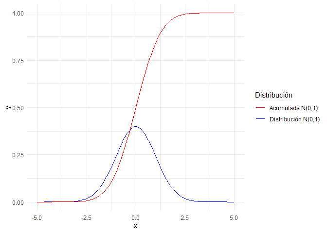
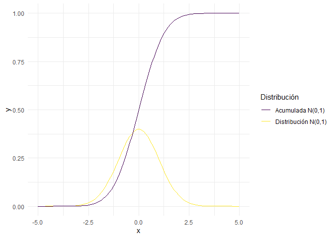
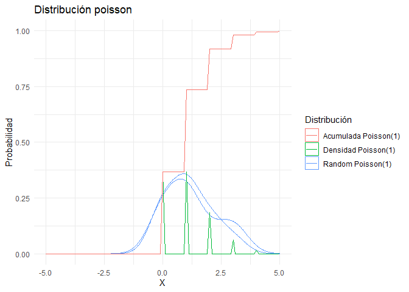
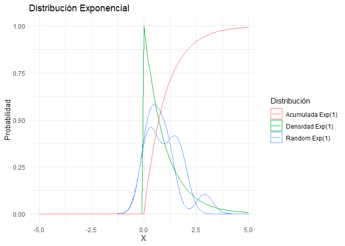
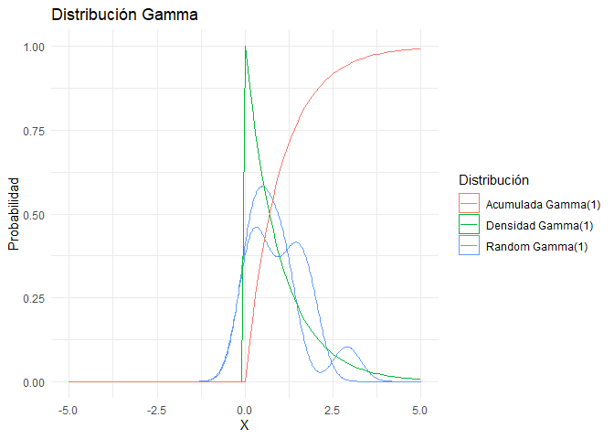

Distribuciones
================
Karina Bartolomé

``` r
library(tidyverse)
library(geomtextpath)
```

``` r
N=100
```

# Distribuciones

En R base existen funciones asociadas a distribuciones. Cada
distribución tiene 4 funciones asociadas:

-   **d**:Función de densidad/probabilidad

-   **p**: Función de distribución acumulada

-   **q**: Función inversa de la distribución acumulada

-   **r**:Función para generar variables aleatorias

``` r
valores <- 1:N
```

# 1. Normal

``` r
valores <- seq(from=-5, to=5, by=0.1)

d_normal <- dnorm(valores, mean=0, sd=1)
p_normal <- pnorm(valores, mean=0, sd=1)
set.seed(1)
r_normal_1 <- rnorm(10,       mean=0, sd=1)
set.seed(2)
r_normal_2 <- rnorm(10,       mean=0, sd=1)
```

Se visualizan las distribuciones. Notar que en X=0 (media de la
distribución normal generada), la probabilidad acumulada es 0.5.

``` r
ggplot()+
  geom_density(aes(x=r_normal_1, color='Random N(0,1)'))+
  geom_density(aes(x=r_normal_2, color='Random N(0,1)'))+
  
  geom_line(aes(x=valores, y=d_normal, color='Densidad N(0,1)'))+
  geom_line(aes(x=valores, y=p_normal, color='Acumulada N(0,1)'))+

  theme_minimal()+
  labs(x='X', y='Probabilidad', 
       title='Distribución normal',
       substitle='Densidad, aleatoria y acumulada',
       color='Distribución'
  )
```

<!-- -->

También es posible graficar la distribución normal con ggplot directo,
utilizando stat_function():

``` r
data.frame(x = c(-5, 5)) %>% 
  ggplot(aes(x = x)) +
    stat_function(fun = dnorm, 
                  n = N, 
                  args = list(mean = 0, sd = 1), 
                  aes(color='Distribución N(0,1)')) + 
    stat_function(fun = pnorm, 
                  n = N, 
                  args = list(mean = 0, sd = 1), 
                  aes(color='Acumulada N(0,1)')) + 
    theme_minimal()+
    labs(color='Distribución')
```

<!-- -->

# Distribución Poisson

``` r
valores <- seq(from=-5, to=5, by=0.1)

d_poisson <- dpois(valores, lambda = 1)
p_poisson <- ppois(valores, lambda = 1)
set.seed(1)
r_poisson_1 <- rpois(10, lambda=1)
set.seed(2)
r_poisson_2 <- rpois(10, lambda=1)
```

``` r
ggplot()+
  geom_density(aes(x=r_poisson_1, color='Random Poisson(1)'))+
  geom_density(aes(x=r_poisson_2, color='Random Poisson(1)'))+
  
  geom_line(aes(x=valores, y=d_poisson, color='Densidad Poisson(1)'))+
  geom_line(aes(x=valores, y=p_poisson, color='Acumulada Poisson(1)'))+

  theme_minimal()+
  labs(x='X', y='Probabilidad', 
       title='Distribución poisson',
       substitle='Densidad, aleatoria y acumulada',
       color='Distribución'
  )
```

<!-- -->

# Distribución Exponencial

``` r
d_expo <- dexp(valores, rate=1)
p_expo <- pexp(valores, rate=1)
set.seed(1)
r_exp_1 <- rexp(10, rate=1)
set.seed(2)
r_exp_2 <- rexp(10, rate=1)
```

``` r
ggplot()+
  geom_density(aes(x=r_exp_1, color='Random Exp(1)'))+
  geom_density(aes(x=r_exp_2, color='Random Exp(1)'))+
  
  geom_line(aes(x=valores, y=d_expo, color='Densidad Exp(1)'))+
  geom_line(aes(x=valores, y=p_expo, color='Acumulada Exp(1)'))+

  theme_minimal()+
  labs(x='X', y='Probabilidad', 
       title='Distribución Exponencial',
       substitle='Densidad, aleatoria y acumulada',
       color='Distribución'
  )
```

<!-- -->

# Distribución Gamma

``` r
d_gamma <- dgamma(valores, shape=1)
p_gamma <- pgamma(valores, shape=1)
set.seed(1)
r_gamma_1 <- rgamma(10, shape=1)
set.seed(2)
r_gamma_2 <- rgamma(10, shape=1)
```

``` r
ggplot()+
  geom_density(aes(x=r_exp_1, color='Random Gamma(1)'))+
  geom_density(aes(x=r_exp_2, color='Random Gamma(1)'))+
  
  geom_line(aes(x=valores, y=d_expo, color='Densidad Gamma(1)'))+
  geom_line(aes(x=valores, y=p_expo, color='Acumulada Gamma(1)'))+

  theme_minimal()+
  labs(x='X', y='Probabilidad', 
       title='Distribución Gamma',
       substitle='Densidad, aleatoria y acumulada',
       color='Distribución'
  )
```

<!-- -->

# Distribución Chi-Cuadrado

``` r
d_chi <- dchisq(valores, df=2)
p_chi <- pchisq(valores, df=2)
set.seed(1)
r_chi_1 <- rchisq(10, df=2)
set.seed(2)
r_chi_2 <- rchisq(10, df=2)
```

``` r
ggplot()+
  geom_density(aes(x=r_chi_1, color='Random Chi(df=2)'))+
  geom_density(aes(x=r_chi_2, color='Random Chi(df=2)'))+
  
  geom_line(aes(x=valores, y=d_chi, color='Densidad Chi(df=2)'))+
  geom_line(aes(x=valores, y=p_chi, color='Acumulada Chi(df=2)'))+

  theme_minimal()+
  labs(x='X', y='Probabilidad', 
       title='Distribución Chi-Cuadrado',
       substitle='Densidad, aleatoria y acumulada',
       color='Distribución'
  )
```

<!-- -->

``` r
knitr::knit_exit()
```
