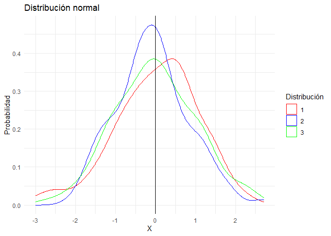
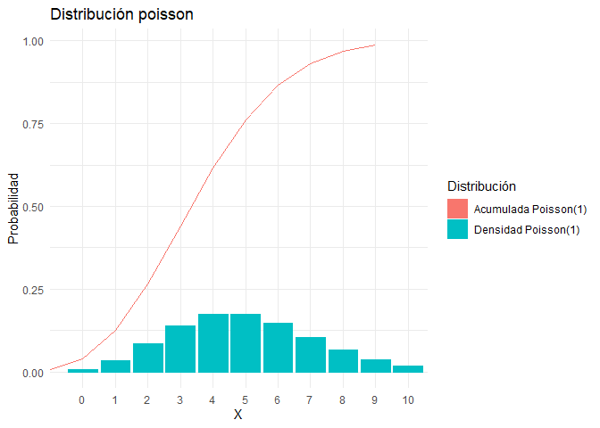

Distribuciones
================
Karina Bartolomé

# Distribuciones

En R base existen funciones asociadas a distribuciones. Cada
distribución tiene 4 funciones asociadas:

-   **d**:Función de densidad/probabilidad

-   **p**: Función de distribución acumulada

-   **q**: Función inversa de la distribución acumulada

-   **r**:Función para generar variables aleatorias

# 1. Normal

Se visualizan las distribuciones. Notar que en X=0 (media de la
distribución normal generada), la probabilidad acumulada es 0.5.

<!-- -->

También es posible graficar la distribución normal con ggplot directo,
utilizando stat_function():

<!-- -->

# Distribución Poisson

<!-- -->

# Distribución Exponencial

<!-- -->

# Distribución Gamma

<!-- -->

# Distribución Chi-Cuadrado

<!-- -->
