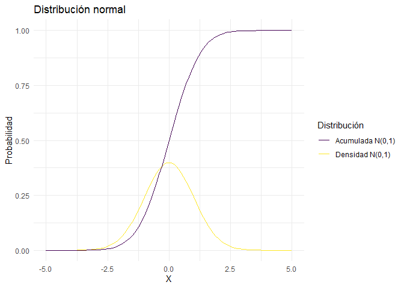
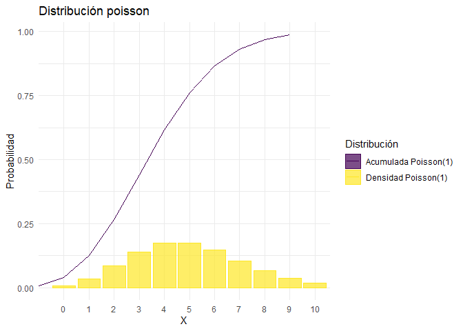
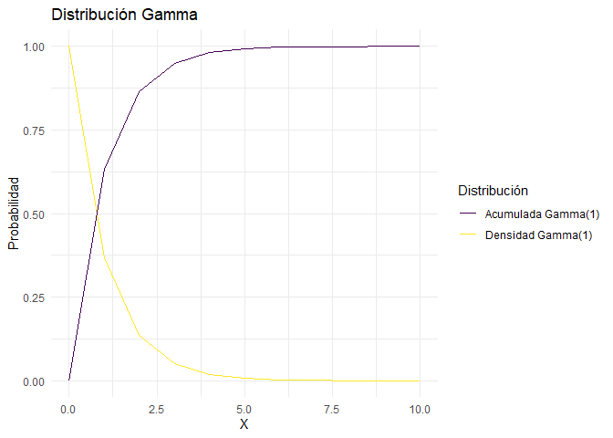

Distribuciones
================
Karina Bartolomé

``` r
library(tidyverse)
library(gt)

source(here::here('','functions/distribuciones.R'))
```

``` r
N         = 100
N_samples = 3
```

# Distribuciones

En R base existen funciones asociadas a distribuciones. Cada
distribución tiene 4 funciones asociadas:

-   **d**:Función de densidad/probabilidad

-   **p**: Función de distribución acumulada

-   **q**: Función inversa de la distribución acumulada

-   **r**:Función para generar variables aleatorias

# 1. Normal

``` r
valores <- seq(from=-5, to=5, by=0.1)

d_normal <- dnorm(valores, mean=0, sd=1)
p_normal <- pnorm(valores, mean=0, sd=1)
```

Se visualizan las distribuciones. Notar que en X=0 (media de la
distribución normal generada), la probabilidad acumulada es 0.5.

``` r
ggplot()+

  geom_line(aes(x=valores, y=d_normal, color='Densidad N(0,1)'))+
  geom_line(aes(x=valores, y=p_normal, color='Acumulada N(0,1)'))+
  
  labs(x='X', y='Probabilidad', 
       title='Distribución normal',
       substitle='Densidad, aleatoria y acumulada',
       color='Distribución'
  )
```

<!-- -->

También es posible graficar la distribución normal con ggplot directo,
utilizando stat_function():

``` r
data.frame(x = c(-5, 5)) %>% 
  ggplot(aes(x = x)) +
    stat_function(fun = dnorm, 
                  n = N, 
                  args = list(mean = 0, sd = 1), 
                  aes(color='Distribución N(0,1)')) + 
    stat_function(fun = pnorm, 
                  n = N, 
                  args = list(mean = 0, sd = 1), 
                  aes(color='Acumulada N(0,1)')) + 
  
    labs(color='Distribución')
```

<!-- -->

Se generan 3 distribuciones normales aleatorias, cada una con 10
observaciones:

``` r
r_random <- gen_rand_distributions(
                       .distribution = rnorm,
                       .n_obs        = N,
                       .n_samples    = N_samples, 
                       mean = 0, sd = 1
                       )
```

``` r
r_random %>% 
  group_by(sample_number) %>% 
  summarise(mean=mean(value), sd=sd(value)) %>% 
  gt()
```

<div id="hdfjtxyxpl" style="overflow-x:auto;overflow-y:auto;width:auto;height:auto;">
<style>html {
  font-family: -apple-system, BlinkMacSystemFont, 'Segoe UI', Roboto, Oxygen, Ubuntu, Cantarell, 'Helvetica Neue', 'Fira Sans', 'Droid Sans', Arial, sans-serif;
}

#hdfjtxyxpl .gt_table {
  display: table;
  border-collapse: collapse;
  margin-left: auto;
  margin-right: auto;
  color: #333333;
  font-size: 16px;
  font-weight: normal;
  font-style: normal;
  background-color: #FFFFFF;
  width: auto;
  border-top-style: solid;
  border-top-width: 2px;
  border-top-color: #A8A8A8;
  border-right-style: none;
  border-right-width: 2px;
  border-right-color: #D3D3D3;
  border-bottom-style: solid;
  border-bottom-width: 2px;
  border-bottom-color: #A8A8A8;
  border-left-style: none;
  border-left-width: 2px;
  border-left-color: #D3D3D3;
}

#hdfjtxyxpl .gt_heading {
  background-color: #FFFFFF;
  text-align: center;
  border-bottom-color: #FFFFFF;
  border-left-style: none;
  border-left-width: 1px;
  border-left-color: #D3D3D3;
  border-right-style: none;
  border-right-width: 1px;
  border-right-color: #D3D3D3;
}

#hdfjtxyxpl .gt_title {
  color: #333333;
  font-size: 125%;
  font-weight: initial;
  padding-top: 4px;
  padding-bottom: 4px;
  border-bottom-color: #FFFFFF;
  border-bottom-width: 0;
}

#hdfjtxyxpl .gt_subtitle {
  color: #333333;
  font-size: 85%;
  font-weight: initial;
  padding-top: 0;
  padding-bottom: 4px;
  border-top-color: #FFFFFF;
  border-top-width: 0;
}

#hdfjtxyxpl .gt_bottom_border {
  border-bottom-style: solid;
  border-bottom-width: 2px;
  border-bottom-color: #D3D3D3;
}

#hdfjtxyxpl .gt_col_headings {
  border-top-style: solid;
  border-top-width: 2px;
  border-top-color: #D3D3D3;
  border-bottom-style: solid;
  border-bottom-width: 2px;
  border-bottom-color: #D3D3D3;
  border-left-style: none;
  border-left-width: 1px;
  border-left-color: #D3D3D3;
  border-right-style: none;
  border-right-width: 1px;
  border-right-color: #D3D3D3;
}

#hdfjtxyxpl .gt_col_heading {
  color: #333333;
  background-color: #FFFFFF;
  font-size: 100%;
  font-weight: normal;
  text-transform: inherit;
  border-left-style: none;
  border-left-width: 1px;
  border-left-color: #D3D3D3;
  border-right-style: none;
  border-right-width: 1px;
  border-right-color: #D3D3D3;
  vertical-align: bottom;
  padding-top: 5px;
  padding-bottom: 6px;
  padding-left: 5px;
  padding-right: 5px;
  overflow-x: hidden;
}

#hdfjtxyxpl .gt_column_spanner_outer {
  color: #333333;
  background-color: #FFFFFF;
  font-size: 100%;
  font-weight: normal;
  text-transform: inherit;
  padding-top: 0;
  padding-bottom: 0;
  padding-left: 4px;
  padding-right: 4px;
}

#hdfjtxyxpl .gt_column_spanner_outer:first-child {
  padding-left: 0;
}

#hdfjtxyxpl .gt_column_spanner_outer:last-child {
  padding-right: 0;
}

#hdfjtxyxpl .gt_column_spanner {
  border-bottom-style: solid;
  border-bottom-width: 2px;
  border-bottom-color: #D3D3D3;
  vertical-align: bottom;
  padding-top: 5px;
  padding-bottom: 6px;
  overflow-x: hidden;
  display: inline-block;
  width: 100%;
}

#hdfjtxyxpl .gt_group_heading {
  padding: 8px;
  color: #333333;
  background-color: #FFFFFF;
  font-size: 100%;
  font-weight: initial;
  text-transform: inherit;
  border-top-style: solid;
  border-top-width: 2px;
  border-top-color: #D3D3D3;
  border-bottom-style: solid;
  border-bottom-width: 2px;
  border-bottom-color: #D3D3D3;
  border-left-style: none;
  border-left-width: 1px;
  border-left-color: #D3D3D3;
  border-right-style: none;
  border-right-width: 1px;
  border-right-color: #D3D3D3;
  vertical-align: middle;
}

#hdfjtxyxpl .gt_empty_group_heading {
  padding: 0.5px;
  color: #333333;
  background-color: #FFFFFF;
  font-size: 100%;
  font-weight: initial;
  border-top-style: solid;
  border-top-width: 2px;
  border-top-color: #D3D3D3;
  border-bottom-style: solid;
  border-bottom-width: 2px;
  border-bottom-color: #D3D3D3;
  vertical-align: middle;
}

#hdfjtxyxpl .gt_from_md > :first-child {
  margin-top: 0;
}

#hdfjtxyxpl .gt_from_md > :last-child {
  margin-bottom: 0;
}

#hdfjtxyxpl .gt_row {
  padding-top: 8px;
  padding-bottom: 8px;
  padding-left: 5px;
  padding-right: 5px;
  margin: 10px;
  border-top-style: solid;
  border-top-width: 1px;
  border-top-color: #D3D3D3;
  border-left-style: none;
  border-left-width: 1px;
  border-left-color: #D3D3D3;
  border-right-style: none;
  border-right-width: 1px;
  border-right-color: #D3D3D3;
  vertical-align: middle;
  overflow-x: hidden;
}

#hdfjtxyxpl .gt_stub {
  color: #333333;
  background-color: #FFFFFF;
  font-size: 100%;
  font-weight: initial;
  text-transform: inherit;
  border-right-style: solid;
  border-right-width: 2px;
  border-right-color: #D3D3D3;
  padding-left: 12px;
}

#hdfjtxyxpl .gt_summary_row {
  color: #333333;
  background-color: #FFFFFF;
  text-transform: inherit;
  padding-top: 8px;
  padding-bottom: 8px;
  padding-left: 5px;
  padding-right: 5px;
}

#hdfjtxyxpl .gt_first_summary_row {
  padding-top: 8px;
  padding-bottom: 8px;
  padding-left: 5px;
  padding-right: 5px;
  border-top-style: solid;
  border-top-width: 2px;
  border-top-color: #D3D3D3;
}

#hdfjtxyxpl .gt_grand_summary_row {
  color: #333333;
  background-color: #FFFFFF;
  text-transform: inherit;
  padding-top: 8px;
  padding-bottom: 8px;
  padding-left: 5px;
  padding-right: 5px;
}

#hdfjtxyxpl .gt_first_grand_summary_row {
  padding-top: 8px;
  padding-bottom: 8px;
  padding-left: 5px;
  padding-right: 5px;
  border-top-style: double;
  border-top-width: 6px;
  border-top-color: #D3D3D3;
}

#hdfjtxyxpl .gt_striped {
  background-color: rgba(128, 128, 128, 0.05);
}

#hdfjtxyxpl .gt_table_body {
  border-top-style: solid;
  border-top-width: 2px;
  border-top-color: #D3D3D3;
  border-bottom-style: solid;
  border-bottom-width: 2px;
  border-bottom-color: #D3D3D3;
}

#hdfjtxyxpl .gt_footnotes {
  color: #333333;
  background-color: #FFFFFF;
  border-bottom-style: none;
  border-bottom-width: 2px;
  border-bottom-color: #D3D3D3;
  border-left-style: none;
  border-left-width: 2px;
  border-left-color: #D3D3D3;
  border-right-style: none;
  border-right-width: 2px;
  border-right-color: #D3D3D3;
}

#hdfjtxyxpl .gt_footnote {
  margin: 0px;
  font-size: 90%;
  padding: 4px;
}

#hdfjtxyxpl .gt_sourcenotes {
  color: #333333;
  background-color: #FFFFFF;
  border-bottom-style: none;
  border-bottom-width: 2px;
  border-bottom-color: #D3D3D3;
  border-left-style: none;
  border-left-width: 2px;
  border-left-color: #D3D3D3;
  border-right-style: none;
  border-right-width: 2px;
  border-right-color: #D3D3D3;
}

#hdfjtxyxpl .gt_sourcenote {
  font-size: 90%;
  padding: 4px;
}

#hdfjtxyxpl .gt_left {
  text-align: left;
}

#hdfjtxyxpl .gt_center {
  text-align: center;
}

#hdfjtxyxpl .gt_right {
  text-align: right;
  font-variant-numeric: tabular-nums;
}

#hdfjtxyxpl .gt_font_normal {
  font-weight: normal;
}

#hdfjtxyxpl .gt_font_bold {
  font-weight: bold;
}

#hdfjtxyxpl .gt_font_italic {
  font-style: italic;
}

#hdfjtxyxpl .gt_super {
  font-size: 65%;
}

#hdfjtxyxpl .gt_footnote_marks {
  font-style: italic;
  font-weight: normal;
  font-size: 65%;
}
</style>
<table class="gt_table">
  
  <thead class="gt_col_headings">
    <tr>
      <th class="gt_col_heading gt_columns_bottom_border gt_left" rowspan="1" colspan="1">sample_number</th>
      <th class="gt_col_heading gt_columns_bottom_border gt_right" rowspan="1" colspan="1">mean</th>
      <th class="gt_col_heading gt_columns_bottom_border gt_right" rowspan="1" colspan="1">sd</th>
    </tr>
  </thead>
  <tbody class="gt_table_body">
    <tr><td class="gt_row gt_left">1</td>
<td class="gt_row gt_right">0.03251482</td>
<td class="gt_row gt_right">1.0413570</td></tr>
    <tr><td class="gt_row gt_left">2</td>
<td class="gt_row gt_right">-0.08748371</td>
<td class="gt_row gt_right">0.9041735</td></tr>
    <tr><td class="gt_row gt_left">3</td>
<td class="gt_row gt_right">-0.01036817</td>
<td class="gt_row gt_right">1.0170123</td></tr>
  </tbody>
  
  
</table>
</div>

``` r
ggplot()+
  
  geom_density(data=r_random, aes(x=value, color=sample_number))+
  
  geom_vline(xintercept=0)+
  
  labs(x='X', y='Probabilidad', 
       title='Distribución normal',
       substitle='Densidad, aleatoria y acumulada',
       color='Distribución'
  )
```

<!-- -->

# Distribución Poisson

``` r
valores <- seq(from=0, to=10, by=1)
lambda = 5

d_poisson <- dpois(valores, lambda = lambda)
p_poisson <- ppois(valores, lambda = lambda)
```

``` r
ggplot()+
  
  geom_col(aes(x=factor(valores), y=d_poisson, 
               color='Densidad Poisson(1)',
               fill='Densidad Poisson(1)'), alpha=0.7)+
  geom_line(aes(x=valores, y=p_poisson, 
                color='Acumulada Poisson(1)', 
                fill='Acumulada Poisson(1)'))+

  labs(x='X', y='Probabilidad', 
       title='Distribución poisson',
       substitle='Densidad, aleatoria y acumulada',
       color='Distribución', fill='Distribución'
  )
```

<!-- -->

``` r
r_poisson <- gen_rand_distributions(.distribution=rpois,
                       .n_obs=N,
                       .n_samples=N_samples, 
                       lambda=lambda)
```

``` r
ggplot()+
  geom_bar(data=r_poisson,
               aes(x=factor(value), fill=sample_number),
               position='dodge',
               alpha=0.7)+

  labs(x='Valor',y='Frecuencia',fill='Muestra',
       title = 'Distribución poisson aleatoria: \nFrecuencia de valores en cada muestra aleatoria',
       subtitle=paste0('Lambda=',lambda))
```

<!-- -->

# Distribución Exponencial

``` r
rate = 1
d_expo <- dexp(valores, rate=rate)
p_expo <- pexp(valores, rate=rate)
```

``` r
ggplot()+
  
  geom_line(aes(x=valores, y=d_expo, color='Densidad Exp(1)'))+
  geom_line(aes(x=valores, y=p_expo, color='Acumulada Exp(1)'))+

  labs(x='X', y='Probabilidad', 
       title='Distribución Exponencial',
       substitle='Densidad, aleatoria y acumulada',
       color='Distribución'
  )
```

<!-- -->

``` r
r_expo <- gen_rand_distributions(
                       .distribution = rexp,
                       .n_obs        = N,
                       .n_samples    = N_samples, 
                       rate = 1
                       )
```

``` r
ggplot()+
  
  geom_density(data=r_expo, aes(x=value, color=sample_number))+

  labs(x='X', y='Probabilidad', 
       title='Distribución exponencial random',
       color='Distribución'
  )
```

<!-- -->

# Distribución Gamma

``` r
shape = 1
d_gamma <- dgamma(valores, shape=shape)
p_gamma <- pgamma(valores, shape=shape)
```

``` r
ggplot()+
  
  geom_line(aes(x=valores, y=d_expo, color='Densidad Gamma(1)'))+
  geom_line(aes(x=valores, y=p_expo, color='Acumulada Gamma(1)'))+

  labs(x='X', y='Probabilidad', 
       title='Distribución Gamma',
       substitle='Densidad, aleatoria y acumulada',
       color='Distribución'
  )
```

<!-- -->

``` r
r_gamma <- gen_rand_distributions(
                       .distribution = rgamma,
                       .n_obs        = N,
                       .n_samples    = N_samples, 
                       shape = shape
                       )
```

``` r
ggplot()+
  
  geom_density(data=r_gamma, aes(x=value, color=sample_number))+

  labs(x='X', y='Probabilidad', 
       title='Distribución gamma random',
       color='Distribución'
  )
```

<!-- -->

# Distribución Chi-Cuadrado

``` r
grados = 2
d_chi <- dchisq(valores, df=grados)
p_chi <- pchisq(valores, df=grados)
```

``` r
ggplot()+
  
  geom_line(aes(x=valores, y=d_chi, color='Densidad Chi(df=2)'))+
  geom_line(aes(x=valores, y=p_chi, color='Acumulada Chi(df=2)'))+

  labs(x='X', y='Probabilidad', 
       title='Distribución Chi-Cuadrado',
       substitle='Densidad, aleatoria y acumulada',
       color='Distribución'
  )
```

<!-- -->

``` r
r_chi <- gen_rand_distributions(
                       .distribution = rchisq,
                       .n_obs        = N,
                       .n_samples    = N_samples, 
                       df = grados
                       )
```

``` r
ggplot()+
  
  geom_density(data=r_chi, aes(x=value, color=sample_number))+
  
  labs(x='X', y='Probabilidad', 
       title='Distribución Chi Cuadrado random',
       color='Distribución'
  )
```

<!-- -->

``` r
knitr::knit_exit()
```
