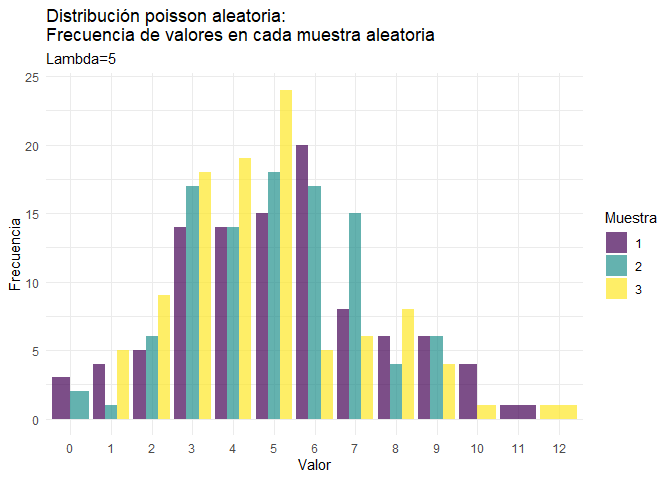

Distribuciones
================
Karina Bartolomé

``` r
library(tidyverse)
library(geomtextpath)

source(here::here('','functions/distribuciones.R'))
```

``` r
N         = 100
N_samples = 3
```

# Distribuciones

En R base existen funciones asociadas a distribuciones. Cada
distribución tiene 4 funciones asociadas:

-   **d**:Función de densidad/probabilidad

-   **p**: Función de distribución acumulada

-   **q**: Función inversa de la distribución acumulada

-   **r**:Función para generar variables aleatorias

# 1. Normal

``` r
valores <- seq(from=-5, to=5, by=0.1)

d_normal <- dnorm(valores, mean=0, sd=1)
p_normal <- pnorm(valores, mean=0, sd=1)
```

Se visualizan las distribuciones. Notar que en X=0 (media de la
distribución normal generada), la probabilidad acumulada es 0.5.

``` r
ggplot()+

  geom_line(aes(x=valores, y=d_normal, color='Densidad N(0,1)'))+
  geom_line(aes(x=valores, y=p_normal, color='Acumulada N(0,1)'))+
  
  scale_color_manual(values=c('red','blue','green'))+

  theme_minimal()+
  labs(x='X', y='Probabilidad', 
       title='Distribución normal',
       substitle='Densidad, aleatoria y acumulada',
       color='Distribución'
  )
```

<!-- -->

También es posible graficar la distribución normal con ggplot directo,
utilizando stat_function():

``` r
data.frame(x = c(-5, 5)) %>% 
  ggplot(aes(x = x)) +
    stat_function(fun = dnorm, 
                  n = N, 
                  args = list(mean = 0, sd = 1), 
                  aes(color='Distribución N(0,1)')) + 
    stat_function(fun = pnorm, 
                  n = N, 
                  args = list(mean = 0, sd = 1), 
                  aes(color='Acumulada N(0,1)')) + 
  
    scale_color_manual(values=c('red','blue','green'))+

    theme_minimal()+
    labs(color='Distribución')
```

<!-- -->

Se generan 3 distribuciones normales aleatorias, cada una con 10
observaciones:

``` r
r_random <- gen_rand_distributions(
                       .distribution = rnorm,
                       .n_obs        = N,
                       .n_samples    = N_samples, 
                       mean = 0, sd = 1
                       )
```

``` r
r_random %>% 
  group_by(name) %>% 
  summarise(mean=mean(value), sd=sd(value))
```

    ## # A tibble: 3 x 3
    ##   name        mean    sd
    ##   <chr>      <dbl> <dbl>
    ## 1 Random 1  0.0325 1.04 
    ## 2 Random 2 -0.0875 0.904
    ## 3 Random 3 -0.0104 1.02

``` r
ggplot()+
  
  geom_density(data=r_random, aes(x=value, color=name))+
  
  geom_vline(xintercept=0)+
  
  scale_color_manual(values=c('red','blue','green'))+

  theme_minimal()+
  labs(x='X', y='Probabilidad', 
       title='Distribución normal',
       substitle='Densidad, aleatoria y acumulada',
       color='Distribución'
  )
```

<!-- -->

# Distribución Poisson

``` r
valores <- seq(from=0, to=10, by=1)
lambda = 5

d_poisson <- dpois(valores, lambda = lambda)
p_poisson <- ppois(valores, lambda = lambda)
```

``` r
ggplot()+
  
  geom_line(aes(x=valores, y=d_poisson, color='Densidad Poisson(1)'))+
  geom_line(aes(x=valores, y=p_poisson, color='Acumulada Poisson(1)'))+

  theme_minimal()+
  labs(x='X', y='Probabilidad', 
       title='Distribución poisson',
       substitle='Densidad, aleatoria y acumulada',
       color='Distribución'
  )
```

<!-- -->

``` r
r_poisson <- gen_rand_distributions(.distribution=rpois,
                       .n_obs=N,
                       .n_samples=N_samples, 
                       lambda=lambda)

ggplot()+
  geom_histogram(data=r_poisson, 
               aes(x=factor(value), fill=name), 
               stat='count',
               position='dodge',
               alpha=0.7)+
  theme_minimal()
```

<!-- -->

# Distribución Exponencial

``` r
rate = 1
d_expo <- dexp(valores, rate=rate)
p_expo <- pexp(valores, rate=rate)
```

``` r
ggplot()+
  
  geom_line(aes(x=valores, y=d_expo, color='Densidad Exp(1)'))+
  geom_line(aes(x=valores, y=p_expo, color='Acumulada Exp(1)'))+

  theme_minimal()+
  labs(x='X', y='Probabilidad', 
       title='Distribución Exponencial',
       substitle='Densidad, aleatoria y acumulada',
       color='Distribución'
  )
```

<!-- -->

``` r
r_expo <- gen_rand_distributions(
                       .distribution = rexp,
                       .n_obs        = N,
                       .n_samples    = N_samples, 
                       rate = 1
                       )
```

``` r
ggplot()+
  
  geom_density(data=r_expo, aes(x=value, color=name))+
  
  scale_color_manual(values=c('red','blue','green'))+

  theme_minimal()+
  labs(x='X', y='Probabilidad', 
       title='Distribución exponencial random',
       color='Distribución'
  )
```

<!-- -->

# Distribución Gamma

``` r
shape = 1
d_gamma <- dgamma(valores, shape=shape)
p_gamma <- pgamma(valores, shape=shape)
```

``` r
ggplot()+
  
  geom_line(aes(x=valores, y=d_expo, color='Densidad Gamma(1)'))+
  geom_line(aes(x=valores, y=p_expo, color='Acumulada Gamma(1)'))+

  theme_minimal()+
  labs(x='X', y='Probabilidad', 
       title='Distribución Gamma',
       substitle='Densidad, aleatoria y acumulada',
       color='Distribución'
  )
```

<!-- -->

``` r
r_gamma <- gen_rand_distributions(
                       .distribution = rgamma,
                       .n_obs        = N,
                       .n_samples    = N_samples, 
                       shape = shape
                       )
```

``` r
ggplot()+
  
  geom_density(data=r_gamma, aes(x=value, color=name))+
  
  scale_color_manual(values=c('red','blue','green'))+

  theme_minimal()+
  labs(x='X', y='Probabilidad', 
       title='Distribución gamma random',
       color='Distribución'
  )
```

<!-- -->

# Distribución Chi-Cuadrado

``` r
grados = 2
d_chi <- dchisq(valores, df=grados)
p_chi <- pchisq(valores, df=grados)
```

``` r
ggplot()+
  
  geom_line(aes(x=valores, y=d_chi, color='Densidad Chi(df=2)'))+
  geom_line(aes(x=valores, y=p_chi, color='Acumulada Chi(df=2)'))+

  theme_minimal()+
  labs(x='X', y='Probabilidad', 
       title='Distribución Chi-Cuadrado',
       substitle='Densidad, aleatoria y acumulada',
       color='Distribución'
  )
```

<!-- -->

``` r
r_chi <- gen_rand_distributions(
                       .distribution = rchisq,
                       .n_obs        = N,
                       .n_samples    = N_samples, 
                       df = grados
                       )
```

``` r
ggplot()+
  
  geom_density(data=r_chi, aes(x=value, color=name))+
  
  scale_color_manual(values=c('red','blue','green'))+

  theme_minimal()+
  labs(x='X', y='Probabilidad', 
       title='Distribución Chi Cuadrado random',
       color='Distribución'
  )
```

<!-- -->

``` r
knitr::knit_exit()
```
