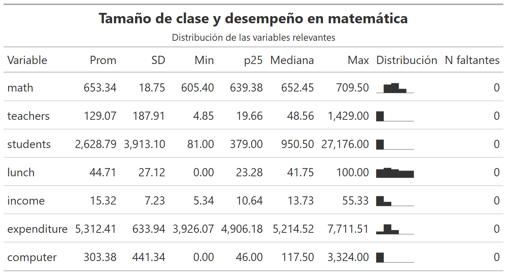
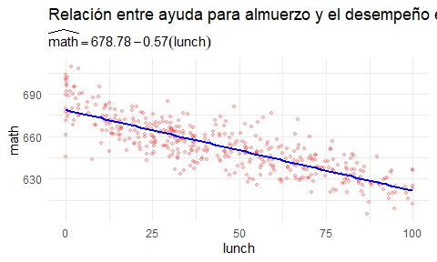
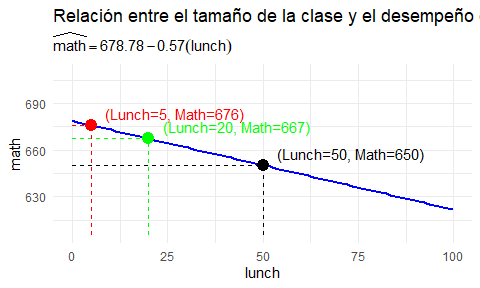
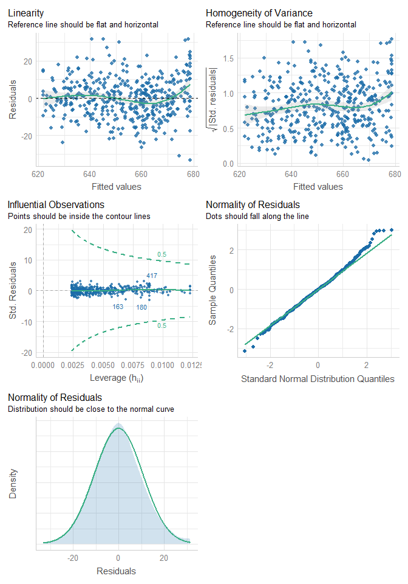
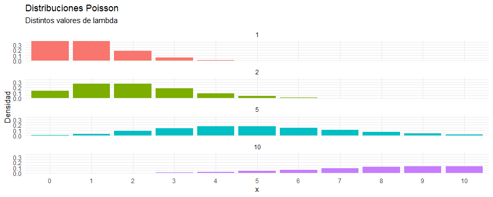

# Referencias

<https://bookdown.org/roback/bookdown-BeyondMLR/ch-MLRreview.html>

``` r
library(tidyverse)
library(gt)
library(AER)
library(performance)

theme_set(theme_minimal())
```

Se utiliza el paquete `{AER}` :package: (Applied Econometric with R),
que contiene un gran número de datasets econométricos.

En este caso, los datos contienen información sobre resultados
educativos,Stock & Watson (2007). Incluyen características
sociodemográficas de estudiantes y escuelas en distritos de California.

``` r
#data(package='AER') # Lista los datasets disponibles en el paquete AER
```

Se cargan los datos:

``` r
data("CASchools")
```



# Algunos conceptos vinculados a regresiones

# 1. Regresión lineal

En esta sección se estima un modelo de regresión linal univariado,
definido como:

*Ŷ* = *α* + *β*<sub>1</sub>*X*<sub>1</sub>

Donde Y es la variable a predecir y X una variable independiente.

Se busca estimar el efecto de **lunch** sobre **math**:

``` r
modelo_reg_lineal <- lm(math ~ lunch, data=CASchools)
```

Con `{equatiomatic}` :package: se visualiza la ecuación del modelo:

``` r
eq <- equatiomatic::extract_eq(modelo_reg_lineal)
eq
```

math  = *α* + *β*<sub>1</sub>(lunch) + *ϵ*

math  = *α* + *β*<sub>1</sub>(lunch) + *ϵ*

También es posible visualizar la regresión lineal estimada (con los
coeficientes correspondientes):

``` r
eq <- equatiomatic::extract_eq(modelo_reg_lineal, 
                         use_coefs=TRUE) 

eq
```

$$
\operatorname{\widehat{math}} = 678.78 - 0.57(\operatorname{lunch})
$$

$\operatorname{\widehat{math}} = 678.78 - 0.57(\operatorname{lunch})$

El error de estimación es la diferencia entre el valor observado y el
valor predicho:

$\operatorname{math} - \operatorname{\widehat{math}} = \epsilon$

Visualmente:





## 1.1: Supuestos para regresión lineal

``` r
performance::check_model(modelo_reg_lineal)
```



------------------------------------------------------------------------

# 2. Regresión lineal multivariada

Ahora se consideran N variables independientes:

*Ŷ* = *α* + *β*<sub>1</sub>*X*<sub>1</sub> + ... + *β*<sub>*n*</sub>*X*<sub>*n*</sub>

``` r
modelo_reg_lineal_multiple <- lm(math ~ lunch+income+students, data=CASchools)
```

Con `{equatiomatic}` :package: se visualiza la ecuación del modelo:

``` r
equatiomatic::extract_eq(modelo_reg_lineal_multiple)
```

math  = *α* + *β*<sub>1</sub>(lunch) + *β*<sub>2</sub>(income) + *β*<sub>3</sub>(students) + *ϵ*

También es posible visualizar la regresión lineal estimada (con los
coeficientes correspondientes):

``` r
equatiomatic::extract_eq(modelo_reg_lineal_multiple, 
                         use_coefs=TRUE) 
```

$\operatorname{\widehat{math}} = 663.02 - 0.44(\operatorname{lunch}) + 0.69(\operatorname{income}) + 0(\operatorname{students})$

# 3. GLM: Generalized linear models

Para casos en los cuales no se cumple el supuesto de normalidad de la
variable Y (outcome).

## 3.1: Regresión logística (outcome binario)

Y \~ Binomial()

``` r
data("CreditCard")
```

``` r
modelo_reg_logistica <- glm(factor(reports > 0) ~ age + income + owner,
                            data = CreditCard, 
                            family = binomial)
```

``` r
equatiomatic::extract_eq(modelo_reg_logistica)
```

$$
\log\left\[ \frac { P( \operatorname{reports} = \operatorname{7} ) }{ 1 - P( \operatorname{reports} = \operatorname{7} ) } \right\] = \alpha + \beta\_{1}(\operatorname{age}) + \beta\_{2}(\operatorname{income}) + \beta\_{3}(\operatorname{owner}\_{\operatorname{yes}})
$$

``` r
equatiomatic::extract_eq(modelo_reg_logistica, use_coefs=TRUE)
```

$$
\log\left\[ \frac { \widehat{P( \operatorname{reports} = \operatorname{7} )} }{ 1 - \widehat{P( \operatorname{reports} = \operatorname{7} )} } \right\] = -2.24 + 0.02(\operatorname{age}) + 0.07(\operatorname{income}) - 0.38(\operatorname{owner}\_{\operatorname{yes}})
$$

``` r
gtsummary::tbl_regression(
  modelo_reg_logistica,
  intercept = TRUE
  ) %>%  gtsummary::as_kable()
```

| **Characteristic** | **log(OR)** | **95% CI**   | **p-value** |
|:-------------------|:------------|:-------------|:------------|
| (Intercept)        | -2.2        | -2.7, -1.8   | \<0.001     |
| age                | 0.02        | 0.01, 0.04   | 0.002       |
| income             | 0.07        | -0.01, 0.15  | 0.10        |
| owner              |             |              |             |
| no                 |             |              |             |
| yes                | -0.38       | -0.69, -0.07 | 0.017       |

## 3.2: Regresión de Poisson (conteo)

Siendo Y el número de eventos que ocurren en un determinado tiempo, Y
puede ser modelado mediante una distribución de Poisson:

$$P(Y=y)=\frac{e^{-λ}λ^{y}}{y!},  \\ y=0,1,2,…,∞$$

Propiedades de la distribución de Poisson:

-   E(Y) = Var(Y) = *λ*

-   Usualmente sesgada a la derecha, particularmente para *λ* chico

-   A medida que *λ* aumenta, la distribución se vuelve más simétrica.
    Si*λ* es lo suficientemente grande, Y se puede aproximar con una
    distribución normal.

``` r
data.frame(x=c(0:10)) %>% 
  mutate(`1`=dpois(x,1), 
         `2`=dpois(x,2),
         `5`=dpois(x,5), 
         `10`=dpois(x,10)) %>% 
  pivot_longer(cols=-x, names_to='lambda') %>%
  mutate(lambda = as.integer(lambda)) %>% 
  ggplot(aes(x=factor(x), y=value, fill=factor(lambda)))+
  geom_col(position='dodge', show.legend=FALSE)+
  facet_wrap(~lambda, nrow = 4)+
  labs(x='x',y='Densidad',
       title='Distribuciones Poisson',
       subtitle='Distintos valores de lambda')
```



``` r
modelo_reg_poisson <- glm(reports ~ age + income + expenditure, 
                          data = CreditCard, family = poisson)

summary(modelo_reg_poisson)
```

    ## 
    ## Call:
    ## glm(formula = reports ~ age + income + expenditure, family = poisson, 
    ##     data = CreditCard)
    ## 
    ## Deviance Residuals: 
    ##     Min       1Q   Median       3Q      Max  
    ## -1.7427  -1.0689  -0.8390  -0.3897   7.4991  
    ## 
    ## Coefficients:
    ##              Estimate Std. Error z value Pr(>|z|)    
    ## (Intercept) -0.819682   0.145272  -5.642 1.68e-08 ***
    ## age          0.007181   0.003978   1.805  0.07105 .  
    ## income       0.077898   0.023940   3.254  0.00114 ** 
    ## expenditure -0.004102   0.000374 -10.968  < 2e-16 ***
    ## ---
    ## Signif. codes:  0 '***' 0.001 '**' 0.01 '*' 0.05 '.' 0.1 ' ' 1
    ## 
    ## (Dispersion parameter for poisson family taken to be 1)
    ## 
    ##     Null deviance: 2347.4  on 1318  degrees of freedom
    ## Residual deviance: 2143.9  on 1315  degrees of freedom
    ## AIC: 2801.4
    ## 
    ## Number of Fisher Scoring iterations: 7

``` r
equatiomatic::extract_eq(modelo_reg_poisson)
```

log (*E*(reports)) = *α* + *β*<sub>1</sub>(age) + *β*<sub>2</sub>(income) + *β*<sub>3</sub>(expenditure)

``` r
equatiomatic::extract_eq(modelo_reg_poisson, use_coefs=TRUE)
```

$\log ({\widehat{E( \operatorname{reports})}}) = -0.82 + 0.01(\operatorname{age}) + 0.08(\operatorname{income}) + 0(\operatorname{expenditure})$

``` r
gtsummary::tbl_regression(
  modelo_reg_poisson,
  intercept = TRUE
  ) %>% gtsummary::as_kable()
```

| **Characteristic** | **log(IRR)** | **95% CI**  | **p-value** |
|:-------------------|:-------------|:------------|:------------|
| (Intercept)        | -0.82        | -1.1, -0.54 | \<0.001     |
| age                | 0.01         | 0.00, 0.01  | 0.071       |
| income             | 0.08         | 0.03, 0.12  | 0.001       |
| expenditure        | 0.00         | 0.00, 0.00  | \<0.001     |
