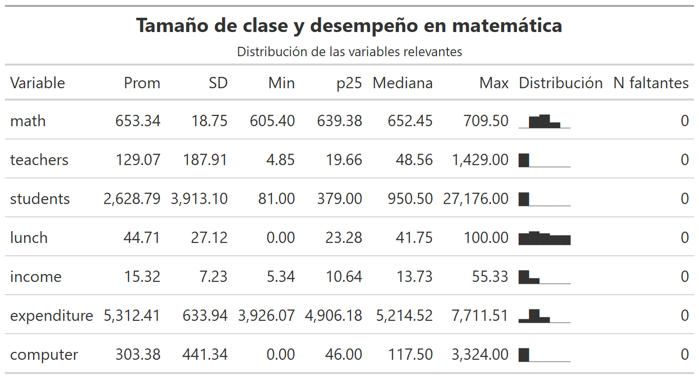

Regresiones
================
Karina Bartolomé
2022-05-01

# Referencias

<https://bookdown.org/roback/bookdown-BeyondMLR/ch-MLRreview.html>

``` r
library(dplyr)
library(ggplot2)
library(gt)
library(AER)
library(performance)
```

Se utiliza el paquete `{AER}` 📦 (Applied Econometric with R), que
contiene un gran número de datasets econométricos.

En este caso, los datos contienen información sobre resultados
educativos,Stock & Watson (2007). Incluyen características
sociodemográficas de estudiantes y escuelas en distritos de California.

``` r
#data(package='AER') # Lista los datasets disponibles en el paquete AER
```

Se cargan los datos:

``` r
data("CASchools")
```

<!-- -->


# Algunos conceptos vinculados a regresiones

# 1. Regresión lineal

En esta sección se estima un modelo de regresión linal univariado,
definido como:


Donde Y es la variable a predecir y X una variable independiente.

Se busca estimar el efecto de **lunch** sobre **math**:

``` r
modelo_reg_lineal <- lm(math ~ lunch, data=CASchools)
```

Con `{equatiomatic}` 📦 se visualiza la ecuación del modelo:

``` r
equatiomatic::extract_eq(modelo_reg_lineal)
```

 + {\color{black}{\epsilon}}")

También es posible visualizar la regresión lineal estimada (con los
coeficientes correspondientes):

``` r
equatiomatic::extract_eq(modelo_reg_lineal, 
                         use_coefs=TRUE) 
```

")

El error de estimación es la diferencia entre el valor observado y el
valor predicho:


Visualmente:

<!-- -->

<!-- -->

## 1.1: Supuestos para regresión lineal

``` r
performance::check_model(modelo_reg_lineal)
```

<!-- -->

------------------------------------------------------------------------

# 2. Regresión lineal multivariada

Ahora se consideran N variables independientes:


``` r
modelo_reg_lineal_multiple <- lm(math ~ lunch+income+students, data=CASchools)
```

Con `{equatiomatic}` 📦 se visualiza la ecuación del modelo:

``` r
equatiomatic::extract_eq(modelo_reg_lineal_multiple)
```

 + \beta_{2}(\operatorname{income}) + \beta_{3}(\operatorname{students}) + \epsilon")

También es posible visualizar la regresión lineal estimada (con los
coeficientes correspondientes):

``` r
equatiomatic::extract_eq(modelo_reg_lineal_multiple, 
                         use_coefs=TRUE) 
```

 + 0.69(\operatorname{income}) + 0(\operatorname{students})")

# 3. GLM: Generalized linear models

Para casos en los cuales no se cumple el supuesto de normalidad de la
variable Y (outcome).

## 3.1: Regresión logística (outcome binario)

Y \~ Binomial()

## 3.2: Regresión de Poisson (conteo)

Y \~ Poisson()
