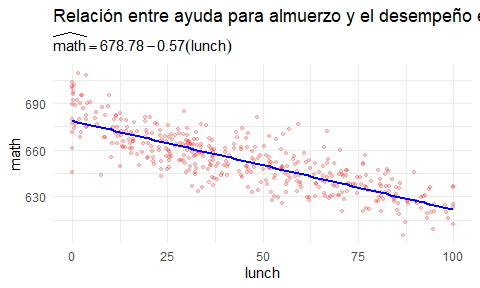
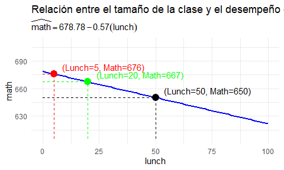
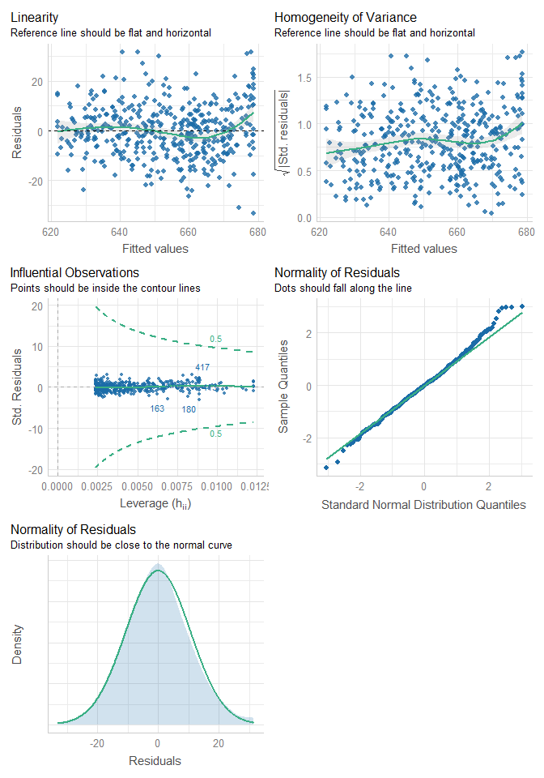

Regresiones
================
Karina Bartolomé
2022-05-01

# Referencias

<https://bookdown.org/roback/bookdown-BeyondMLR/ch-MLRreview.html>

``` r
library(dplyr)
library(ggplot2)
library(gt)
library(AER)
library(performance)
```

Se utiliza el paquete `{AER}` 📦 (Applied Econometric with R), que
contiene un gran número de datasets econométricos.

En este caso, los datos contienen información sobre resultados
educativos,Stock & Watson (2007). Incluyen características
sociodemográficas de estudiantes y escuelas en distritos de California.

``` r
#data(package='AER') # Lista los datasets disponibles en el paquete AER
```

Se cargan los datos:

``` r
data("CASchools")
```

<div id="qsophdkzqq" style="overflow-x:auto;overflow-y:auto;width:auto;height:auto;">
<style>html {
  font-family: -apple-system, BlinkMacSystemFont, 'Segoe UI', Roboto, Oxygen, Ubuntu, Cantarell, 'Helvetica Neue', 'Fira Sans', 'Droid Sans', Arial, sans-serif;
}

#qsophdkzqq .gt_table {
  display: table;
  border-collapse: collapse;
  margin-left: auto;
  margin-right: auto;
  color: #333333;
  font-size: 16px;
  font-weight: normal;
  font-style: normal;
  background-color: #FFFFFF;
  width: auto;
  border-top-style: solid;
  border-top-width: 2px;
  border-top-color: #A8A8A8;
  border-right-style: none;
  border-right-width: 2px;
  border-right-color: #D3D3D3;
  border-bottom-style: solid;
  border-bottom-width: 2px;
  border-bottom-color: #A8A8A8;
  border-left-style: none;
  border-left-width: 2px;
  border-left-color: #D3D3D3;
}

#qsophdkzqq .gt_heading {
  background-color: #FFFFFF;
  text-align: center;
  border-bottom-color: #FFFFFF;
  border-left-style: none;
  border-left-width: 1px;
  border-left-color: #D3D3D3;
  border-right-style: none;
  border-right-width: 1px;
  border-right-color: #D3D3D3;
}

#qsophdkzqq .gt_title {
  color: #333333;
  font-size: 125%;
  font-weight: initial;
  padding-top: 4px;
  padding-bottom: 4px;
  border-bottom-color: #FFFFFF;
  border-bottom-width: 0;
}

#qsophdkzqq .gt_subtitle {
  color: #333333;
  font-size: 85%;
  font-weight: initial;
  padding-top: 0;
  padding-bottom: 4px;
  border-top-color: #FFFFFF;
  border-top-width: 0;
}

#qsophdkzqq .gt_bottom_border {
  border-bottom-style: solid;
  border-bottom-width: 2px;
  border-bottom-color: #D3D3D3;
}

#qsophdkzqq .gt_col_headings {
  border-top-style: solid;
  border-top-width: 2px;
  border-top-color: #D3D3D3;
  border-bottom-style: solid;
  border-bottom-width: 2px;
  border-bottom-color: #D3D3D3;
  border-left-style: none;
  border-left-width: 1px;
  border-left-color: #D3D3D3;
  border-right-style: none;
  border-right-width: 1px;
  border-right-color: #D3D3D3;
}

#qsophdkzqq .gt_col_heading {
  color: #333333;
  background-color: #FFFFFF;
  font-size: 100%;
  font-weight: normal;
  text-transform: inherit;
  border-left-style: none;
  border-left-width: 1px;
  border-left-color: #D3D3D3;
  border-right-style: none;
  border-right-width: 1px;
  border-right-color: #D3D3D3;
  vertical-align: bottom;
  padding-top: 5px;
  padding-bottom: 6px;
  padding-left: 5px;
  padding-right: 5px;
  overflow-x: hidden;
}

#qsophdkzqq .gt_column_spanner_outer {
  color: #333333;
  background-color: #FFFFFF;
  font-size: 100%;
  font-weight: normal;
  text-transform: inherit;
  padding-top: 0;
  padding-bottom: 0;
  padding-left: 4px;
  padding-right: 4px;
}

#qsophdkzqq .gt_column_spanner_outer:first-child {
  padding-left: 0;
}

#qsophdkzqq .gt_column_spanner_outer:last-child {
  padding-right: 0;
}

#qsophdkzqq .gt_column_spanner {
  border-bottom-style: solid;
  border-bottom-width: 2px;
  border-bottom-color: #D3D3D3;
  vertical-align: bottom;
  padding-top: 5px;
  padding-bottom: 6px;
  overflow-x: hidden;
  display: inline-block;
  width: 100%;
}

#qsophdkzqq .gt_group_heading {
  padding: 8px;
  color: #333333;
  background-color: #FFFFFF;
  font-size: 100%;
  font-weight: initial;
  text-transform: inherit;
  border-top-style: solid;
  border-top-width: 2px;
  border-top-color: #D3D3D3;
  border-bottom-style: solid;
  border-bottom-width: 2px;
  border-bottom-color: #D3D3D3;
  border-left-style: none;
  border-left-width: 1px;
  border-left-color: #D3D3D3;
  border-right-style: none;
  border-right-width: 1px;
  border-right-color: #D3D3D3;
  vertical-align: middle;
}

#qsophdkzqq .gt_empty_group_heading {
  padding: 0.5px;
  color: #333333;
  background-color: #FFFFFF;
  font-size: 100%;
  font-weight: initial;
  border-top-style: solid;
  border-top-width: 2px;
  border-top-color: #D3D3D3;
  border-bottom-style: solid;
  border-bottom-width: 2px;
  border-bottom-color: #D3D3D3;
  vertical-align: middle;
}

#qsophdkzqq .gt_from_md > :first-child {
  margin-top: 0;
}

#qsophdkzqq .gt_from_md > :last-child {
  margin-bottom: 0;
}

#qsophdkzqq .gt_row {
  padding-top: 8px;
  padding-bottom: 8px;
  padding-left: 5px;
  padding-right: 5px;
  margin: 10px;
  border-top-style: solid;
  border-top-width: 1px;
  border-top-color: #D3D3D3;
  border-left-style: none;
  border-left-width: 1px;
  border-left-color: #D3D3D3;
  border-right-style: none;
  border-right-width: 1px;
  border-right-color: #D3D3D3;
  vertical-align: middle;
  overflow-x: hidden;
}

#qsophdkzqq .gt_stub {
  color: #333333;
  background-color: #FFFFFF;
  font-size: 100%;
  font-weight: initial;
  text-transform: inherit;
  border-right-style: solid;
  border-right-width: 2px;
  border-right-color: #D3D3D3;
  padding-left: 12px;
}

#qsophdkzqq .gt_summary_row {
  color: #333333;
  background-color: #FFFFFF;
  text-transform: inherit;
  padding-top: 8px;
  padding-bottom: 8px;
  padding-left: 5px;
  padding-right: 5px;
}

#qsophdkzqq .gt_first_summary_row {
  padding-top: 8px;
  padding-bottom: 8px;
  padding-left: 5px;
  padding-right: 5px;
  border-top-style: solid;
  border-top-width: 2px;
  border-top-color: #D3D3D3;
}

#qsophdkzqq .gt_grand_summary_row {
  color: #333333;
  background-color: #FFFFFF;
  text-transform: inherit;
  padding-top: 8px;
  padding-bottom: 8px;
  padding-left: 5px;
  padding-right: 5px;
}

#qsophdkzqq .gt_first_grand_summary_row {
  padding-top: 8px;
  padding-bottom: 8px;
  padding-left: 5px;
  padding-right: 5px;
  border-top-style: double;
  border-top-width: 6px;
  border-top-color: #D3D3D3;
}

#qsophdkzqq .gt_striped {
  background-color: rgba(128, 128, 128, 0.05);
}

#qsophdkzqq .gt_table_body {
  border-top-style: solid;
  border-top-width: 2px;
  border-top-color: #D3D3D3;
  border-bottom-style: solid;
  border-bottom-width: 2px;
  border-bottom-color: #D3D3D3;
}

#qsophdkzqq .gt_footnotes {
  color: #333333;
  background-color: #FFFFFF;
  border-bottom-style: none;
  border-bottom-width: 2px;
  border-bottom-color: #D3D3D3;
  border-left-style: none;
  border-left-width: 2px;
  border-left-color: #D3D3D3;
  border-right-style: none;
  border-right-width: 2px;
  border-right-color: #D3D3D3;
}

#qsophdkzqq .gt_footnote {
  margin: 0px;
  font-size: 90%;
  padding: 4px;
}

#qsophdkzqq .gt_sourcenotes {
  color: #333333;
  background-color: #FFFFFF;
  border-bottom-style: none;
  border-bottom-width: 2px;
  border-bottom-color: #D3D3D3;
  border-left-style: none;
  border-left-width: 2px;
  border-left-color: #D3D3D3;
  border-right-style: none;
  border-right-width: 2px;
  border-right-color: #D3D3D3;
}

#qsophdkzqq .gt_sourcenote {
  font-size: 90%;
  padding: 4px;
}

#qsophdkzqq .gt_left {
  text-align: left;
}

#qsophdkzqq .gt_center {
  text-align: center;
}

#qsophdkzqq .gt_right {
  text-align: right;
  font-variant-numeric: tabular-nums;
}

#qsophdkzqq .gt_font_normal {
  font-weight: normal;
}

#qsophdkzqq .gt_font_bold {
  font-weight: bold;
}

#qsophdkzqq .gt_font_italic {
  font-style: italic;
}

#qsophdkzqq .gt_super {
  font-size: 65%;
}

#qsophdkzqq .gt_footnote_marks {
  font-style: italic;
  font-weight: normal;
  font-size: 65%;
}
</style>
<table class="gt_table">
  <thead class="gt_header">
    <tr>
      <th colspan="9" class="gt_heading gt_title gt_font_normal" style><strong>Tamaño de clase y desempeño en matemática</strong></th>
    </tr>
    <tr>
      <th colspan="9" class="gt_heading gt_subtitle gt_font_normal gt_bottom_border" style>Distribución de las variables relevantes</th>
    </tr>
  </thead>
  <thead class="gt_col_headings">
    <tr>
      <th class="gt_col_heading gt_columns_bottom_border gt_left" rowspan="1" colspan="1">Variable</th>
      <th class="gt_col_heading gt_columns_bottom_border gt_right" rowspan="1" colspan="1">Prom</th>
      <th class="gt_col_heading gt_columns_bottom_border gt_right" rowspan="1" colspan="1">SD</th>
      <th class="gt_col_heading gt_columns_bottom_border gt_right" rowspan="1" colspan="1">Min</th>
      <th class="gt_col_heading gt_columns_bottom_border gt_right" rowspan="1" colspan="1">p25</th>
      <th class="gt_col_heading gt_columns_bottom_border gt_right" rowspan="1" colspan="1">Mediana</th>
      <th class="gt_col_heading gt_columns_bottom_border gt_right" rowspan="1" colspan="1">Max</th>
      <th class="gt_col_heading gt_columns_bottom_border gt_left" rowspan="1" colspan="1">Distribución</th>
      <th class="gt_col_heading gt_columns_bottom_border gt_right" rowspan="1" colspan="1">N faltantes</th>
    </tr>
  </thead>
  <tbody class="gt_table_body">
    <tr><td class="gt_row gt_left">math</td>
<td class="gt_row gt_right">653.34</td>
<td class="gt_row gt_right">18.75</td>
<td class="gt_row gt_right">605.40</td>
<td class="gt_row gt_right">639.38</td>
<td class="gt_row gt_right">652.45</td>
<td class="gt_row gt_right">709.50</td>
<td class="gt_row gt_left">▁▆▇▃▁</td>
<td class="gt_row gt_right">0</td></tr>
    <tr><td class="gt_row gt_left">teachers</td>
<td class="gt_row gt_right">129.07</td>
<td class="gt_row gt_right">187.91</td>
<td class="gt_row gt_right">4.85</td>
<td class="gt_row gt_right">19.66</td>
<td class="gt_row gt_right">48.56</td>
<td class="gt_row gt_right">1,429.00</td>
<td class="gt_row gt_left">▇▁▁▁▁</td>
<td class="gt_row gt_right">0</td></tr>
    <tr><td class="gt_row gt_left">students</td>
<td class="gt_row gt_right">2,628.79</td>
<td class="gt_row gt_right">3,913.10</td>
<td class="gt_row gt_right">81.00</td>
<td class="gt_row gt_right">379.00</td>
<td class="gt_row gt_right">950.50</td>
<td class="gt_row gt_right">27,176.00</td>
<td class="gt_row gt_left">▇▁▁▁▁</td>
<td class="gt_row gt_right">0</td></tr>
    <tr><td class="gt_row gt_left">lunch</td>
<td class="gt_row gt_right">44.71</td>
<td class="gt_row gt_right">27.12</td>
<td class="gt_row gt_right">0.00</td>
<td class="gt_row gt_right">23.28</td>
<td class="gt_row gt_right">41.75</td>
<td class="gt_row gt_right">100.00</td>
<td class="gt_row gt_left">▆▇▆▅▅</td>
<td class="gt_row gt_right">0</td></tr>
    <tr><td class="gt_row gt_left">income</td>
<td class="gt_row gt_right">15.32</td>
<td class="gt_row gt_right">7.23</td>
<td class="gt_row gt_right">5.34</td>
<td class="gt_row gt_right">10.64</td>
<td class="gt_row gt_right">13.73</td>
<td class="gt_row gt_right">55.33</td>
<td class="gt_row gt_left">▇▃▁▁▁</td>
<td class="gt_row gt_right">0</td></tr>
    <tr><td class="gt_row gt_left">expenditure</td>
<td class="gt_row gt_right">5,312.41</td>
<td class="gt_row gt_right">633.94</td>
<td class="gt_row gt_right">3,926.07</td>
<td class="gt_row gt_right">4,906.18</td>
<td class="gt_row gt_right">5,214.52</td>
<td class="gt_row gt_right">7,711.51</td>
<td class="gt_row gt_left">▂▇▃▁▁</td>
<td class="gt_row gt_right">0</td></tr>
    <tr><td class="gt_row gt_left">computer</td>
<td class="gt_row gt_right">303.38</td>
<td class="gt_row gt_right">441.34</td>
<td class="gt_row gt_right">0.00</td>
<td class="gt_row gt_right">46.00</td>
<td class="gt_row gt_right">117.50</td>
<td class="gt_row gt_right">3,324.00</td>
<td class="gt_row gt_left">▇▁▁▁▁</td>
<td class="gt_row gt_right">0</td></tr>
  </tbody>
  
  
</table>
</div>

# Algunos conceptos vinculados a regresiones

# 1. Regresión lineal


Se busca estimar el efecto de lunch sobre math:

``` r
modelo_reg_lineal <- lm(math ~ lunch, data=CASchools)
```

Con {equatiomatic} se visualiza la ecuación del modelo:

``` r
equatiomatic::extract_eq(modelo_reg_lineal)
```

 + {\color{black}{\epsilon}}")

También es posible visualizar la regresión lineal estimada (con los
coeficientes correspondientes):

``` r
equatiomatic::extract_eq(modelo_reg_lineal, use_coefs=TRUE) 
```

")

El error de estimación es la diferencia entre el valor observado y el
valor predicho:


Visualmente:

<!-- -->

<!-- -->

## 1.1: Supuestos para regresión lineal

``` r
performance::check_model(modelo_reg_lineal)
```

<!-- -->

------------------------------------------------------------------------

# 2. Regresión lineal multivariada

# 3. GLM: Generalized linear models

Para casos en los cuales no se cumple el supuesto de normalidad de la
variable Y (outcome).

## 3.1: Regresión logística (outcome binario)

Y \~ Binomial()

## 3.2: Regresión de Poisson (conteo)

Y \~ Poisson()
